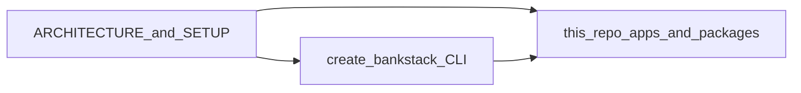

# Bankstack: project vision and layout

## Vision

Bankstack is **scaffolding plus conventions** for the stack described in this repository: an opinionated Nx monorepo aimed at a 2026 **Cloudflare edge + Supabase** split (fast TypeScript at the edge, optional async compute, shared auth and RLS). It is not a new framework; it encodes architecture, boundaries, and setup so teams can start from a known-good shape instead of wiring generators by hand.

The product center is a **published Node CLI** (under `packages/create-bankstack`), installable with npm or pnpm, comparable in spirit to running something like [`npx @tanstack/cli create …`](https://tanstack.com/cli/latest/docs/installation) for TanStack: you run a `create` command from the registry, answer prompts (or use flags), and get a repo that already matches the documented stack and tasks.

This **bankstack** repository is also the **canonical dogfood**: the public site and docs (for example an Astro app under `apps/docs` for bankstack.dev) should be built with the same stack the CLI scaffolds, alongside the CLI package and agent skills. That keeps documentation, examples, and templates aligned.

## How the docs fit together

| Document | Role |
| -------- | ---- |
| [ARCHITECTURE_OVERVIEW.md](ARCHITECTURE_OVERVIEW.md) | **What** you are building: topology, Cloudflare deployment, security and auth. |
| [SETUP_GUIDE.md](SETUP_GUIDE.md) | **How** to assemble it step by step today—and what the CLI should eventually automate. |
| This file | **Why** the monorepo is shaped this way and **what** ships to users (CLI, site, skills). |

## Delivery surfaces

1. **`packages/create-bankstack` (npm / pnpm)**  
   The code published to npm. The planned experience is: run something like `pnpm dlx create-bankstack@latest` or `npx create-bankstack@latest` (exact package and binary names follow whatever you publish) to generate a new workspace that reflects [ARCHITECTURE_OVERVIEW.md](ARCHITECTURE_OVERVIEW.md) and [SETUP_GUIDE.md](SETUP_GUIDE.md).

2. **`apps/*` (example and docs)**  
   Applications in this repo demonstrate the stack in production use. A docs or marketing app proves the same adapters, bindings, and patterns consumers get from the CLI.

3. **`skills/bankstack-expert/SKILL.md` and skills.sh**  
   **Agent skills** are portable instruction bundles (typically a folder with `SKILL.md` and optional assets) that coding agents can load from project paths such as `.cursor/skills/` or `.agents/skills/`. The [skills.sh](https://skills.sh/) ecosystem and tools like `npx skills add …` let developers install a skill **without** scaffolding a full Bankstack repo—useful when you already have a codebase but want Bankstack-specific guardrails and workflows. The CLI targets **greenfield** monorepos; the skill targets **existing** projects and agent sessions.

## Dogfooding

The CLI, the public site, and the skill should evolve together: architecture and setup stay honest in the guides, templates in the CLI track those guides, and this repo consumes its own outputs where practical.



## Intended monorepo layout

The tree below describes the **target** layout for this repository as the product matures. Until those directories exist on disk, treat it as aspirational; the authoritative **consumer** shape for a full split-stack (marketing, dashboard, API, optional compute) remains the diagram in [ARCHITECTURE_OVERVIEW.md](ARCHITECTURE_OVERVIEW.md). This repo may start narrower—for example docs-first under `apps/docs`—and grow toward parity with that overview.

```text
/bankstack
├── /apps
│   └── /docs                 # Astro: bankstack.dev (docs and marketing on the real stack)
├── /packages
│   └── /create-bankstack     # Node CLI published to npm; scaffolds new Bankstack workspaces
├── /skills
│   └── /bankstack-expert
│       └── SKILL.md          # Agent skill; distributable via skills.sh separately from the CLI
├── package.json
└── nx.json
```

A project created by the CLI is expected to align with the **apps and packages** layout in the architecture overview (`apps/marketing`, `apps/dashboard`, `apps/api`, shared `packages/*`, and so on), not necessarily with this repo’s minimal `apps/docs` slice while the product is still bootstrapping.
